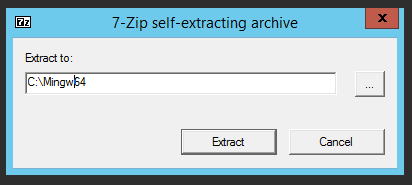
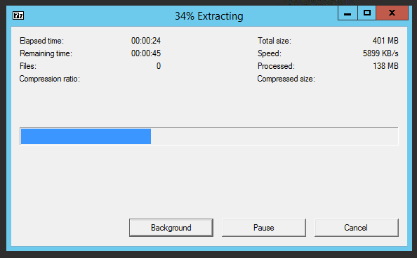
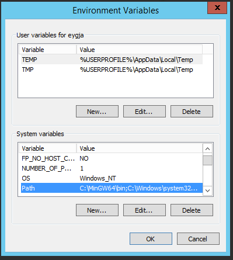
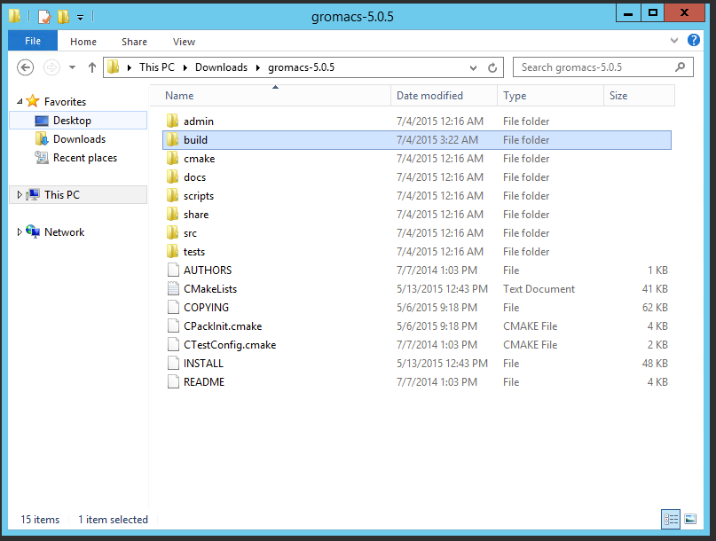
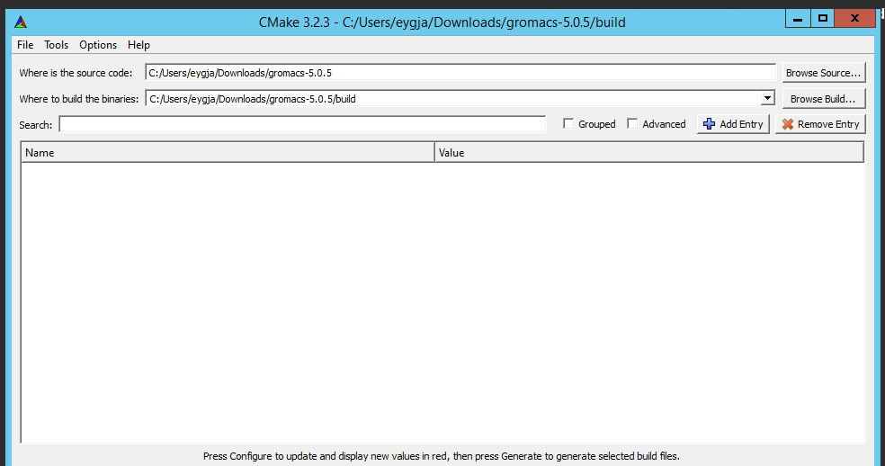

GROMACS 安装（本手册下载到本地之后才能正常看图）
===============

这篇随笔按照安装步骤，为 Gromacs 安装各个库的兼容版本和的最小功能版构建工具。要进行完整的构建和安装，下列软件包/库是必需的：

- mingw
- boost
- cmake
- fftw3

如果系统能够提供支持，或者合适硬件和可用集群满足其一或者全部，那么还应安装 CUDA 和 MPI 之类的扩展。

在 64 位 Windows 计算机上安装
-------------------------------------
### MinGW

MinGW 是 "Minimalist GCC for Windows" 的缩写，是基于 GCC 的 Windows 编译器。默认的官方版 http://sourceforge.net/projects/mingw/files/ "mingw-get-setup.exe" 是 32 位版，在我们的例子中不会使用这个版本，而是选用来自 https://nuwe.net/mingw.html 网站的 64 位分流版，好处就是已经自带了最新的 Boost 库。

首先，从下面地址下载 MinGW 安装程序：

http://nuwen.net/files/mingw/mingw-13.0-without-git.exe

在启动下载的 exe 程序后，按照提示选择合适的文件解压位置。这里可能是提示在 C 盘给我们一个安装目录 C:/MinGW.



（安装位置我们改为 C:/Mingw64）



**重点：此时，MinGW 必须添加到搜索路径 PATH，否则 cmake 实用程序会碰到试图找到合适编译器版本的问题。**

点开开始菜单，然后右击“计算机”并选择“属性”。在打开窗口的左边，选择“高级系统设置”。再在打开的新窗口点击“环境变量...”按钮。向下滚动到底部列表项，找到 PATH 变量：



接着，将提取版的位置，如C:/MingGW/bin，加到“值”一列中；

最后接受改变，并关闭对话框。

### Cmake

CMake 是“交叉平台 Make”的缩写，它是一个让你容易在多个系统上用多种编译器构建项目的工具。

只需简单下载再安装最新版即可：

http://www.cmake.org/cmake/resources/software.html （阅读下面的 Windows 适用的“二进制发布”）

### fftw3

FFTW 是一个用于计算任意输入点数和实数、复数数据的一维或多维离散傅立叶变换 (DFT) 的 C 子程序库（也可用于奇偶性数据，此时叫离散余弦/正弦变换，英文缩写即 DCT/DST）。

有编译好的库可以直接从此处下载：

ftp://ftp.fftw.org/pub/fftw/fftw-3.3.4-dll64.zip

然而，在这里，我们使用 GROMACS 内附的 fftw 尽快让其安装版运行起来。

现在，先决条件已经满足，是时候开始构建 GROMACS 了。

### GROMACS

最新版可以从 http://www.gromacs.org/Downloads 处的发行版表格中的链接下载。

当前可用稳定版为 5.0.5，从这里下载：

ftp://ftp.gromacs.org/pub/gromacs/gromacs-5.0.5.tar.gz

解压软件包内容到合适位置，然后改变目录到那个位置并在里面创建一个名为 build 的目录。

在 cmake GUI 中，在 (Where is the source code) 源码位置框和 (Where to biuld the binaries) 构建位置框填写相应的源码路径和构建路径：



点 configure，在弹出菜单中选 MinGW Makefiles 作为项目的生成器，并使用默认的编译器。

若出现任何错误，都能通过检查对应的命令选项，根据需要添加/删除来矫正。



下面是依赖于你的计算机架构和可用库可用的构建选项：

|构建选项 | 解释|
|-|-|
| CMAKE_C_COMPILER=xxx | xxx 是你希望使用的 C99 编译器名字（或环境变量 CC）|
| CMAKE_CXX_COMPILER=xxx | xxx 是你希望使用的 C++98 编译器名字（或环境变量 CXX）|
| GMX_MPI=on | 将使用 MPI 打包的编译器完成构建任务|
| GMX_GPU=on | 将使用 nvcc 完成支持 NVIDIA GPU 的构建任务|
| GMX_SIMD=xxx | 指定运行 mdrun 时需要节点支持的 SIMD 级别|
| GMX_BUILD_MDRUN_ONLY=on | 只构建 mdrun 二进制程序，一般用于计算集群的后端节点|
| GMX_DOUBLE=on | 构建 GROMACS 双精度版（更慢且一般不用）|
| CMAKE_PREFIX_PATH=xxx | 添加 CMake 的非标准库搜索路径|
| CMAKE_INSTALL_PREFIX=xxx | 安装 GROMACS 到非标准位置（默认在 /usr/local/gromacs 处）|
| BUILD_SHARED_LIBS=off | 不构建共享库|
| GMX_FFT_LIBRARY=xxx | 选用 fftw, mkl 还是 fftpack 库来提供 FFT 支持|
| CMAKE_BUILD_TYPE=Debug | 构建调试模式的 GROMACS|

一旦 configure 没有任何问题，就能开始项目生成。

最后，改变到你创建的 build 目录，你应看到前面两次操作产生的文件。

打开 CMD 窗口，在改变到的这个位置，依次运行下列指令：

```bash
make
make install
```

这将先编译 gromacs 可执行二进制文件，再将其安装到 Windows 安装程序文件夹中的合适文件夹里面。
